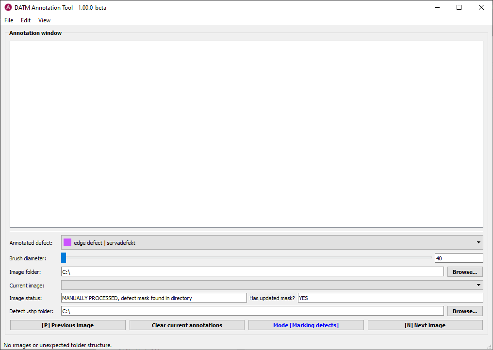
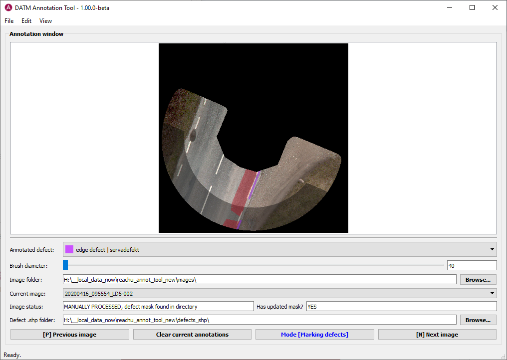

# datm-annotation-tool
datm-annotation-tool is a PyQt5 application intended for annotating road segment orthoframes in two ways:

* Masking out the paved area of the road, this usually means to correct an existing mask;
* Marking pavement defects by painting over them.

Both of these goals are achieved using painting tools implemented in a standalone component **QtImageAnnotator** derived from [PyQtImageViewer](https://github.com/marcel-goldschen-ohm/PyQtImageViewer). This component can be used separately from the application. It is available in the `ui_lib` folder.

Note that for large images (over 4k by 4k resolution in either dimension) the painting will become slower (though still possible).

Basic instructions on how to use the tool are provided next.

### Installation

The most common way to install the tool is to use an Anaconda Python environment. Assuming Anaconda is not installed, these are the steps to follow:

1. Install the latest Anaconda Python 3.7+ distribution from [https://www.anaconda.com/distribution/](https://www.anaconda.com/distribution/)
2. Clone or download *datm-annotation-tool* repository from GitHub.
3. Open *Anaconda Prompt* and `cd` to the root of the downloaded repository.
4. Run `conda env create -f datm-annotation-tool.yml` and wait for the process to finish.
5. Run `conda activate datm-annotation-tool`. Note that you will have to activate the environment every time you want to run the application from Anaconda Prompt.
6. Finally, run the application with `python datmant.py`
7. **NB!** You can also build an executable version of the application with the provided batch script (on Windows only) by running `Build_Win64_executable` from Anaconda Prompt in the repository directory after following steps 1 through 5. In this case, the `datmant` folder will appear under the  `dist` folder in the repository root. In it, you will find the `datmant.exe` which you can now use to start the application. You can copy the `datmant` folder to any desired location on your hard drive or even share with your colleagues who do not have Python installed on Windows. Note that the resulting folder can have a size of about 1GB uncompressed.

### Usage

#### File System Considerations

After starting the tool, you are presented with the following interface:

The first thing to do, is to browse to the folder that contains the orthoframes of interest. To do this, click on the **Browse...** button in the bottom portion of the interface. Note, that every orthoframe image `FILENAME.jpg` file in the folder is assumed to have particular companion files:

* `FILENAME.marked.jpg`: this file should contain defect markings painted over pavement distress. The Python script for creating these files is available separately. For testing purposes, you can simple create these files by adding `.marked` to the end of the file name before the extension.
* `FILENAME.cut.mask.png`: the auto-corrected mask of the paved road part of the image. If it does not exist, an empty mask will be used.

Also note that the tool will produce the following files for every processed orthoframe:

* `FILENAME.cut.mask_v2.png`: The manually corrected mask (usually some manual correction is required). If no correction is made to the original mask, this file will contain a copy of the original mask.
* `FILENAME.defect.mask.png`: The mask for defects found on the orthoframe.

Once the folder with orthoframes of interest is selected, the first orthoframe found in the folder will be automatically loaded into the tool:

You can expand the tool by either manually resizing its window or by double-clicking the title bar and begin the annotation process.

#### Annotating Orthoframes: Tutorial

As discussed above, the objective is to create two masks for each orthoframe of interest. First one is intended for marking defects, and the second one for correcting the paved road area mask.

The topmost graphics port of the application is used to paint in the defects and mask once an image is loaded into it. By default, the *defect marking mode* is always set when a new image is loaded into memory.

It is assumed that a typical computer mouse with three buttons and a scroll wheel is used for manipulating the image.

**Painting tools:**

* To change the painting mode (defects or mask in-painting), use the button on the bottom of the UI. The color of the button also hints at the colors with which defects and non-paved areas are marked: blue and red, respectively.
* To paint over a defect or unpaved area (depending on the mode), **left click and drag.****
* To erase any paint (any annotation is erased independent on the mode!), use **control-left click**.
* To change brush size, **rotate the mouse wheel** while **holding control**. You can also change the size of the brush using the corresponding slider in the UI.
* To create *line segments*, **left click** once at the starting point and then **shift-left click** at the end point.
* To fill bounded areas with selected brush color, position the brush over the area and press **[F]** on the keyboard.
* There is also a 10 step buffer for undoing incorrect painting operations via the usual shortcut **CTRL+Z**. Note however that a forward step is not yet available, so once undone you cannot reverse the operation via CTRL+Y.

At the moment, the **[R]** *Clear ALL annotations* feature is not functional yet.

**Navigation tools:**

* To zoom in on a particular portion of the image **right click and drag** over the region of interest.
* To zoom out, **double right click**.
* To pan the image while zoomed-in, **middle click and drag**.

Note that **companion files will be automatically created for each orthoframe** once you choose another one from the *Current image* list or press **[P]** *Previous image* or **[N]** *Next image*. The application also warns you when navigating files whether you have reached either end of the folder.

The procedure for in-painting defects and correcting the mask is showcased for a single orthoframe in the following animation:

